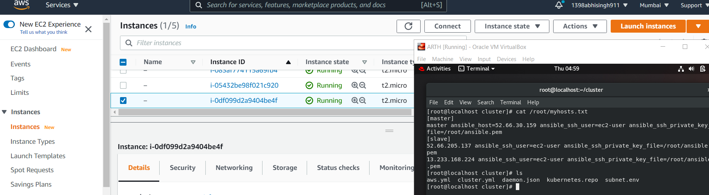
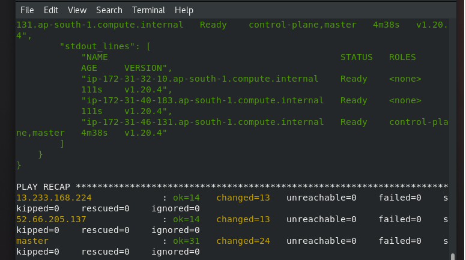
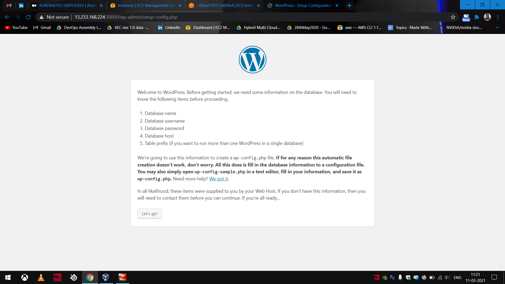

# k8s_cluster_ansible_role
## Table of contents
* [General info](#general-info)

* [Setup](#setup)

## General info
This project is for automation of the k8s cluster using ANSIBLE ON AWS CLOUD using ANSIBLE-ROLES.

	
## Technologies
Project is created with:
* ANSIBLE
* AWS

	
## Setup
To run this project, do the following:

```
$ CLONE THE REPO AND GO INSIDE.
$ CONFIGURE THE PRVILEGE ESCALATION PART OF CONFIG FILES FOR AWS.
$ SET THE MASTER AND SLAVE IN INVENTORY
$ ansible-playbook harole.yml
$ GO TO PUBLICIP OF WORKER NODE:30000.
$ IN WORDPRESS PORT WRITE THE FOLLOWING:
  DATABASE NAME: MYDB
  USERNAME: abhi
  PASSWORD: redhat
  ENTER IP OF CONTAINER INSIDE MYSQLPOD
  TABLE_PREFIX: wp_
```
<p align="center">
  
  
 
</p>
